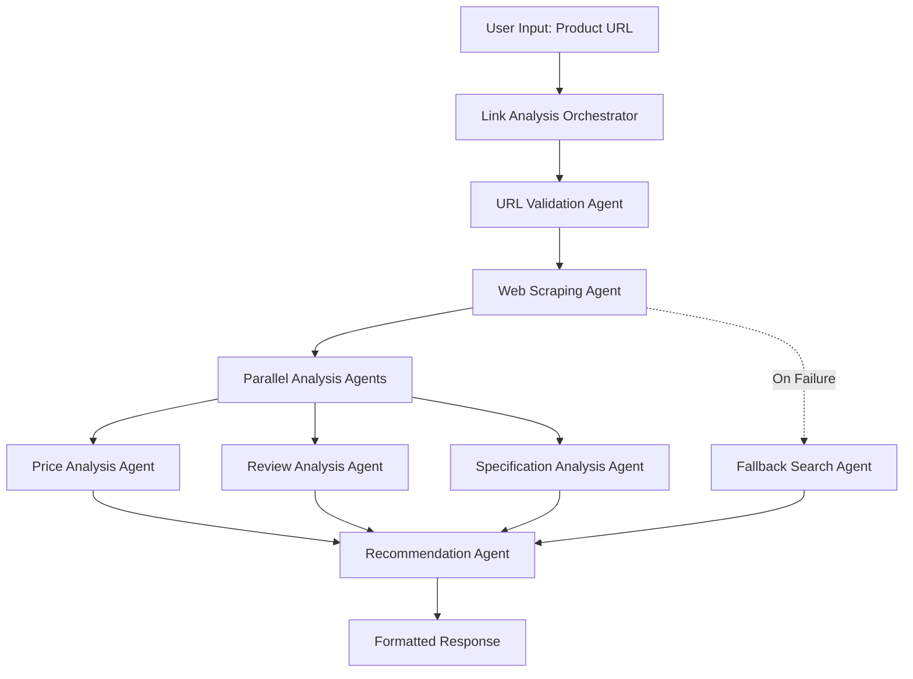

# Design Document

## Overview

The multi-agent link analysis system will replace the current mock implementation with a robust, real-world product data extraction system using Google Agent SDK. The system will employ specialized agents for different aspects of link analysis: web scraping, price analysis, review analysis, and final recommendations.

The design follows a multi-agent architecture where each agent has a specific responsibility, allowing for better error handling, scalability, and maintainability. The system will handle major Indian e-commerce platforms and provide comprehensive product insights.

## Architecture

### High-Level Architecture



### Agent Workflow

1. **URL Validation Agent**: Validates and categorizes the input URL
2. **Web Scraping Agent**: Extracts raw product data from the webpage
3. **Parallel Analysis Agents**: Process different aspects of the product data simultaneously
4. **Recommendation Agent**: Synthesizes all analyses into actionable recommendations
5. **Fallback Search Agent**: Provides alternative data when direct extraction fails

## Components and Interfaces

### 1. MultiAgentLinkAnalyzer Class

Main orchestrator class that coordinates all agents and manages the analysis workflow.

```python
class MultiAgentLinkAnalyzer:
    def __init__(self):
        self.gemini_api_key: str
        self.serper_api_key: str
        self.model: GenerativeModel
        self.agent_system: SequentialAgent
        
    def analyze_product_link(self, url: str) -> Dict[str, Any]
    def _initialize_agents(self) -> None
    def _validate_url(self, url: str) -> Dict[str, str]
    def _extract_domain_info(self, url: str) -> Dict[str, str]
```

### 2. URL Validation Agent

Validates URLs and determines the appropriate extraction strategy.

```python
class URLValidationAgent(LlmAgent):
    name: str = "URLValidationAgent"
    instruction: str = "Validate and categorize e-commerce URLs"
    output_key: str = "url_validation"
    
    def validate_url(self, url: str) -> Dict[str, Any]
    def get_platform_type(self, domain: str) -> str
    def check_url_accessibility(self, url: str) -> bool
```

### 3. Web Scraping Agent

Extracts product data from web pages using multiple strategies.

```python
class WebScrapingAgent(LlmAgent):
    name: str = "WebScrapingAgent"
    instruction: str = "Extract product data from e-commerce websites"
    output_key: str = "scraped_data"
    
    def scrape_product_data(self, url: str, platform: str) -> Dict[str, Any]
    def _scrape_amazon(self, url: str) -> Dict[str, Any]
    def _scrape_flipkart(self, url: str) -> Dict[str, Any]
    def _scrape_generic(self, url: str) -> Dict[str, Any]
    def _extract_with_selectors(self, soup: BeautifulSoup, selectors: Dict) -> Dict
```

### 4. Price Analysis Agent

Analyzes pricing data and provides market insights.

```python
class PriceAnalysisAgent(LlmAgent):
    name: str = "PriceAnalysisAgent"
    instruction: str = "Analyze product pricing and market value"
    output_key: str = "price_analysis"
    
    def analyze_price(self, product_data: Dict) -> Dict[str, Any]
    def get_price_history(self, product_name: str) -> List[Dict]
    def compare_market_price(self, price: float, category: str) -> Dict
```

### 5. Review Analysis Agent

Processes customer reviews and ratings for sentiment analysis.

```python
class ReviewAnalysisAgent(LlmAgent):
    name: str = "ReviewAnalysisAgent"
    instruction: str = "Analyze customer reviews and ratings"
    output_key: str = "review_analysis"
    
    def analyze_reviews(self, reviews_data: List[Dict]) -> Dict[str, Any]
    def extract_sentiment(self, reviews: List[str]) -> Dict[str, float]
    def identify_common_issues(self, reviews: List[str]) -> List[str]
```

### 6. Specification Analysis Agent

Analyzes product specifications and features.

```python
class SpecificationAnalysisAgent(LlmAgent):
    name: str = "SpecificationAnalysisAgent"
    instruction: str = "Analyze product specifications and features"
    output_key: str = "spec_analysis"
    
    def analyze_specifications(self, spec_data: Dict) -> Dict[str, Any]
    def compare_features(self, specs: Dict, category: str) -> Dict
    def identify_key_features(self, specs: Dict) -> List[str]
```

### 7. Recommendation Agent

Synthesizes all analyses into final recommendations.

```python
class RecommendationAgent(LlmAgent):
    name: str = "RecommendationAgent"
    instruction: str = "Provide comprehensive product recommendations"
    output_key: str = "recommendations"
    
    def generate_recommendations(self, all_analyses: Dict) -> str
    def calculate_value_score(self, analyses: Dict) -> float
    def suggest_alternatives(self, product_data: Dict) -> List[Dict]
```

### 8. Fallback Search Agent

Provides alternative data when direct extraction fails.

```python
class FallbackSearchAgent(LlmAgent):
    name: str = "FallbackSearchAgent"
    instruction: str = "Find alternative product data when extraction fails"
    output_key: str = "fallback_data"
    
    def search_by_url(self, url: str) -> Dict[str, Any]
    def extract_search_terms(self, url: str) -> List[str]
    def find_similar_products(self, search_terms: List[str]) -> List[Dict]
```

## Data Models

### ProductData Model

```python
@dataclass
class ProductData:
    title: str
    price: Optional[float]
    currency: str = "INR"
    rating: Optional[float]
    review_count: Optional[int]
    availability: str
    image_urls: List[str]
    specifications: Dict[str, Any]
    description: str
    brand: Optional[str]
    category: Optional[str]
    seller: Optional[str]
    delivery_info: Optional[str]
    offers: List[str]
    url: str
    platform: str
    extracted_at: datetime
```

### AnalysisResult Model

```python
@dataclass
class AnalysisResult:
    product_data: ProductData
    price_analysis: Dict[str, Any]
    review_analysis: Dict[str, Any]
    spec_analysis: Dict[str, Any]
    recommendations: str
    value_score: float
    confidence_score: float
    extraction_success: bool
    errors: List[str]
    alternatives: List[Dict]
```

### Platform Configuration

```python
PLATFORM_CONFIGS = {
    "amazon.in": {
        "selectors": {
            "title": "#productTitle",
            "price": ".a-price-whole",
            "rating": ".a-icon-alt",
            "reviews": "[data-hook='review-body']",
            "availability": "#availability span",
            "image": "#landingImage",
            "specifications": "#feature-bullets ul"
        },
        "headers": {
            "User-Agent": "Mozilla/5.0 (Windows NT 10.0; Win64; x64) AppleWebKit/537.36"
        },
        "rate_limit": 2.0
    },
    "flipkart.com": {
        "selectors": {
            "title": ".B_NuCI",
            "price": "._30jeq3",
            "rating": "._3LWZlK",
            "reviews": ".t-ZTKy",
            "availability": "._16FRp0",
            "image": "._396cs4",
            "specifications": "._1mXcCf"
        },
        "headers": {
            "User-Agent": "Mozilla/5.0 (Windows NT 10.0; Win64; x64) AppleWebKit/537.36"
        },
        "rate_limit": 1.5
    }
}
```

## Error Handling

### Error Categories

1. **Network Errors**: Connection timeouts, DNS failures
2. **Access Errors**: 403 Forbidden, rate limiting, CAPTCHA
3. **Parsing Errors**: Invalid HTML, missing selectors
4. **Data Validation Errors**: Invalid price formats, missing required fields

### Error Handling Strategy

```python
class ErrorHandler:
    def handle_network_error(self, error: Exception, url: str) -> Dict
    def handle_access_error(self, status_code: int, url: str) -> Dict
    def handle_parsing_error(self, error: Exception, html: str) -> Dict
    def trigger_fallback(self, url: str, error_type: str) -> Dict
```

### Retry Logic

- **Network errors**: Exponential backoff with 3 retries
- **Rate limiting**: Respect retry-after headers
- **Parsing errors**: Try alternative selectors
- **Complete failure**: Trigger fallback search

## Testing Strategy

### Unit Tests

1. **Agent Testing**: Test each agent individually with mock data
2. **Scraping Logic**: Test selector-based extraction with sample HTML
3. **Data Validation**: Test ProductData model validation
4. **Error Handling**: Test error scenarios and fallback mechanisms

### Integration Tests

1. **End-to-End Workflow**: Test complete link analysis pipeline
2. **Platform Compatibility**: Test with real URLs from supported platforms
3. **Multi-Agent Coordination**: Test agent communication and data flow
4. **Performance Testing**: Test response times and resource usage

### Test Data

```python
TEST_URLS = {
    "amazon_valid": "https://www.amazon.in/dp/B08N5WRWNW",
    "flipkart_valid": "https://www.flipkart.com/product/p/itm123",
    "invalid_url": "https://invalid-domain.com/product",
    "blocked_url": "https://site-with-captcha.com/product"
}

MOCK_RESPONSES = {
    "amazon_html": "<html>...</html>",
    "flipkart_html": "<html>...</html>",
    "error_403": {"status_code": 403, "content": "Forbidden"}
}
```

### Performance Benchmarks

- **Response Time**: < 10 seconds for successful extraction
- **Success Rate**: > 85% for supported platforms
- **Fallback Rate**: < 15% of requests should require fallback
- **Memory Usage**: < 100MB per analysis request

## Security Considerations

### Web Scraping Ethics

1. **Respect robots.txt**: Check and follow robots.txt directives
2. **Rate Limiting**: Implement delays between requests
3. **User-Agent**: Use appropriate user-agent strings
4. **Terms of Service**: Ensure compliance with platform ToS

### Data Privacy

1. **No Personal Data**: Avoid extracting user-specific information
2. **Data Retention**: Don't store scraped data permanently
3. **Request Logging**: Log only essential request metadata

### Security Headers

```python
DEFAULT_HEADERS = {
    "User-Agent": "Mozilla/5.0 (compatible; ShoppingBot/1.0)",
    "Accept": "text/html,application/xhtml+xml,application/xml;q=0.9,*/*;q=0.8",
    "Accept-Language": "en-US,en;q=0.5",
    "Accept-Encoding": "gzip, deflate",
    "Connection": "keep-alive",
    "Upgrade-Insecure-Requests": "1"
}
```